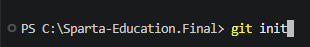
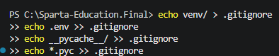
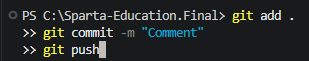

*Step 1;* Installing Git within code file. 

**Step 2;** Installing .gitignore - ensures confidential data doesn't get committed. 

-------------------------------

**Step 3;** Creating a Virtual Environment.

*Git*
Pull and Push requests; 

      

------

Creating nessasory files, 
>> mkdir extract         
>> mkdir transform

>> mkdir load                    
>> mkdir utils  